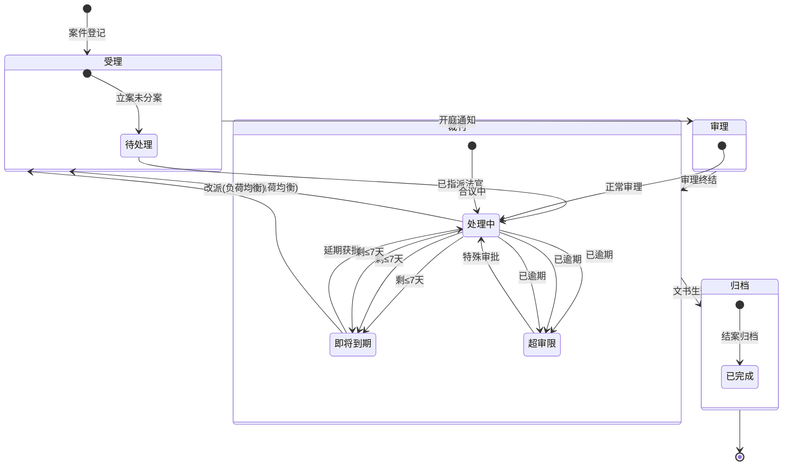

# 集中管辖分案系统流转机制说明文档

## 一、系统概述

本系统是**河南省环境资源案件集中管辖分案系统**，实现了环境资源案件从登记、管辖匹配、跨区划移送、繁简分流、法官指派到结案归档的全流程自动化管理。系统覆盖河南省6个环境资源巡回法庭，通过智能算法实现案件的精准分配和法官负荷的动态均衡。

### 系统覆盖范围（6个巡回法庭）

| 法庭代码 | 法庭名称 | 覆盖区域 |
|---------|---------|---------|
| ZZ | 郑州环境资源巡回法庭 | 郑州市、开封市、新乡市 |
| LY | 洛阳环境资源巡回法庭 | 洛阳市、三门峡市、济源市 |
| AY | 安阳环境资源巡回法庭 | 安阳市、鹤壁市、濮阳市 |
| SQ | 商丘环境资源巡回法庭 | 商丘市、周口市 |
| XY | 信阳环境资源巡回法庭 | 信阳市、驻马店市、漯河市、许昌市 |
| JZ | 焦作环境资源巡回法庭 | 焦作市、鹤壁市、济源市 |

---

## 二、主链路完整流转流程

```
┌─────────────────┐     ┌─────────────────┐     ┌─────────────────┐
│   案件登记立案   │────▶│  管辖法庭匹配   │────▶│  繁简分流评估   │
└─────────────────┘     └─────────────────┘     └─────────────────┘
                                                         │
                                                         ▼
┌─────────────────┐     ┌─────────────────┐     ┌─────────────────┐
│   法官负荷均衡   │◀────│  专业匹配度计算  │◀────│  跨区划移送判定 │
└─────────────────┘     └─────────────────┘     └─────────────────┘
         │
         ▼
┌─────────────────┐     ┌─────────────────┐     ┌─────────────────┐
│  独任/合议庭指派│────▶│  案件阶段流转   │────▶│  超审限预警     │
└─────────────────┘     └─────────────────┘     └─────────────────┘
                                                         │
                                                         ▼
                                               ┌─────────────────┐
                                               │   结案归档      │
                                               └─────────────────┘
```

---

## 三、管辖匹配规则详解

**核心文件**：`src/services/jurisdictionService.ts`

### 3.1 匹配优先级算法

管辖匹配采用**四级递进匹配策略**，置信度从高到低：

| 匹配层级 | 匹配规则 | 置信度 | 说明 |
|---------|---------|--------|------|
| 第一级 | 区县精确匹配 | 100 | 案件发生地区县在法庭`coveredCounties`列表中精确匹配（支持模糊包含匹配） |
| 第二级 | 跨区域关键词匹配 | 90 | 案件描述含"跨、交界、沿线、流域、沿岸、走廊、通道"等关键词时，匹配覆盖区域最多的法庭 |
| 第三级 | 地级市匹配 | 80 | 区县匹配失败时，按地级市`coveredCities`匹配 |
| 第四级 | 默认兜底 | 50 | 以上均失败时，默认分配郑州法庭（ZZ）或首个激活法庭 |

### 3.2 跨区划判定逻辑

```typescript
// 判定条件（满足任一即为跨区划）
1. 案件描述包含跨区域关键词（见上表）
2. 区县与法庭覆盖区县不匹配，但地级市匹配
3. 地级市与法庭覆盖地级市均不匹配
```

### 3.3 匹配结果输出

```typescript
interface JurisdictionMatchResult {
  circuitCourt: ICircuitCourt;      // 匹配到的巡回法庭
  isCrossRegional: boolean;         // 是否跨区划案件
  originalJurisdiction: string;     // 原管辖地（城市+区县）
  matchConfidence: number;          // 匹配置信度 0-100
}
```

---

## 四、繁简分流评估算法

**核心文件**：`src/services/caseAssignmentService.ts:36-52`

### 4.1 评分规则

采用**加权评分制**，总分≥50分为**繁案（COMPLEX）**，<50分为**简案（SIMPLE）**：

| 评估项 | 分值 | 说明 |
|-------|------|------|
| 涉及多方当事人 | +20 | involvesMultipleParties=true |
| 涉案金额较大 | +25 | involvesLargeAmount=true |
| 存在技术难点 | +30 | hasTechnicalDifficulty=true |
| 跨区划案件 | +15 | isCrossRegional=true |
| 具有社会影响 | +25 | hasSocialImpact=true |
| 描述含关键词 | +10/词 | 重大、恶劣、严重、跨省、跨市、集团、系列、疑难、复杂 |

### 4.2 审限配置

| 案件类型 | 总审限 | 受理阶段 | 审理阶段 | 裁判阶段 | 归档阶段 |
|---------|-------|---------|---------|---------|---------|
| 简案 | 45天 | 3天 | 20天 | 15天 | 5天 |
| 繁案 | 90天 | 7天 | 45天 | 30天 | 10天 |

---

## 五、法官指派与负荷均衡算法

**核心文件**：
- `src/services/caseAssignmentService.ts:54-239`
- `src/services/workloadBalanceService.ts`

### 5.1 案件类型与法官专业映射表

| 案件类型 | 优先匹配法官专业 |
|---------|----------------|
| 污染环境 | 污染防治、生态修复 |
| 非法采矿 | 矿产资源、生态修复 |
| 非法狩猎 | 野生动植物 |
| 生态损害赔偿 | 生态修复、污染防治 |
| 非法伐木 | 野生动植物、生态修复 |
| 非法捕捞 | 水资源、野生动植物 |
| 野生动植物保护 | 野生动植物 |
| 水资源保护 | 水资源、污染防治 |

### 5.2 简案指派算法（独任制）

```
法官综合得分 = 专业匹配加分 - 负荷扣分项 + 综合法官加分

其中：
- 专业匹配加分：有匹配专业 +30
- 综合法官加分：含GENERAL专业 +10
- 负荷扣分项：(当前案件数/最大负荷) × 50
```

**输出**：得分最高的1名法官独任审理

### 5.3 繁案指派算法（合议制）

```
法官综合得分 = 专业匹配数×25 - 负荷扣分项 + 综合法官加分

其中：
- 专业匹配加分：每个匹配专业 ×25
- 综合法官加分：含GENERAL专业 +10
- 负荷扣分项：(当前案件数/最大负荷) × 40
```

**输出**：得分最高的前3名法官组成合议庭，第1名为审判长

### 5.4 动态负荷均衡机制

#### 5.4.1 负荷监控指标

```typescript
// 负荷状态判定
workloadPercentage = (activeCases / maxCaseLoad) × 100

- 正常：< 80%
- 预警：≥ 80% 且 < 100%
- 过载：≥ 100%
```

#### 5.4.2 自动改派触发条件

当法官负荷超过阈值时，系统自动筛选**可改派案件**：
- 案件阶段：仅受理阶段（ACCEPTED）
- 状态：待处理（PENDING）
- 类型：优先简案（SIMPLE）
- 未开始实质审理：trialStartDate 为空

#### 5.4.3 改派目标法官评分

```
推荐法官综合得分 = 专业匹配得分 + 负荷空间得分

其中：
- 专业匹配得分 = 匹配专业数 × 25
- 负荷空间得分 = (1 - 当前负荷率) × 50
```

#### 5.4.4 不均衡度评估

```
不均衡比率 = (最高负荷 - 最低负荷) / 平均负荷
```

---

## 六、跨区划移送轨迹生成

**核心文件**：
- `src/controllers/caseController.ts:74-96`
- `src/services/caseFlowService.ts:246-252`

### 6.1 移送触发条件

当 `jurisdictionResult.isCrossRegional === true` 时，自动生成移送轨迹。

### 6.2 移送轨迹数据结构

```typescript
interface ITransferTrail {
  caseId: ObjectId;              // 案件ID
  fromCourt: string;             // 移出法院名称
  fromCourtId?: ObjectId;        // 移出法庭ID（巡回法庭间移送时）
  toCourt: string;               // 接收法院名称
  toCourtId: ObjectId;           // 接收巡回法庭ID
  transferSource: TransferSource;// 移送来源（地方法院/检察院/公安/其他巡回法庭/当事人申请）
  transferReason: string;        // 移送理由（固定为"跨行政区划环境资源案件集中管辖移送"）
  transferDate: Date;            // 移送日期
  receivedDate?: Date;           // 接收日期
  transferDocuments: string[];   // 移送材料清单
  operatorName?: string;         // 经办人
  remark?: string;               // 备注
}
```

### 6.3 自动移送材料清单

系统自动生成以下移送材料：
1. 案件移送函
2. 立案审批表
3. 证据材料清单
4. 当事人身份证明

---

## 七、模块间数据衔接

### 7.1 数据流转链路

```
HTTP请求
    │
    ▼
caseController.registerCase()
    │
    ├─► JurisdictionService.matchCircuitCourt()
    │     返回：{ circuitCourt, isCrossRegional, originalJurisdiction }
    │
    ├─► CaseFlowService.registerCase()
    │     ├─► CaseAssignmentService.assessComplexity()
    │     │     返回：CaseComplexity
    │     ├─► 生成Case文档并保存
    │     └─► CaseAssignmentService.assignCase()
    │           ├─► 简案：assignSimpleCase()
    │           └─► 繁案：assignComplexCase()
    │           返回：{ judge, isPanel, panelJudges, assignmentReason }
    │
    └─► 跨区划判定
          └─► 是：CaseFlowService.createTransferTrail()
                生成：ITransferTrail
```

### 7.2 核心数据模型关联

```
Case (案件主表)
    │
    ├─ circuitCourtId ──► CircuitCourt (巡回法庭)
    ├─ judgeId ─────────► Judge (承办法官)
    ├─ panelJudges ─────► Judge[] (合议庭成员)
    │
    ├─ 1:N ──► CaseFlowRecord (案件流转记录)
    ├─ 1:N ──► TransferTrail (移送轨迹记录)
    └─ 1:N ──► JudgeReassignmentTrail (法官改派记录)
```

---

## 八、状态流转图

### 8.1 案件阶段与状态矩阵



### 8.2 状态自动迁移规则

**核心文件**：`src/services/caseFlowService.ts:262-362`

系统定时任务自动扫描所有活跃案件，按以下规则更新状态：

| 当前状态 | 条件 | 目标状态 | 操作 |
|---------|------|---------|------|
| 处理中 | 剩余天数 ≤7 | 即将到期 | 系统催办，记录流转 |
| 处理中 | 剩余天数 <0 | 超审限 | 系统预警，记录流转 |
| 即将到期 | 剩余天数 >7 | 处理中 | 状态恢复正常 |
| 超审限 | 剩余天数 ≥0 | 处理中 | 状态恢复正常 |

---

## 九、法官改派机制

**核心文件**：`src/services/workloadBalanceService.ts:329-439`

### 9.1 改派执行流程

```
┌─────────────────┐
│  法官过载检测   │
└─────────┬───────┘
          │
          ▼
┌─────────────────┐
│ 筛选可改派案件  │ 仅受理阶段、未开庭、优先简案
└─────────┬───────┘
          │
          ▼
┌─────────────────┐
│ 推荐法官排序    │ 专业匹配 + 负荷空间
└─────────┬───────┘
          │
          ▼
┌─────────────────┐
│ 事务性执行改派  │  MongoDB事务
│  ├─ 更新案件judgeId
│  ├─ 原法官案件数-1
│  ├─ 新法官案件数+1
│  ├─ 写入改派轨迹
│  └─ 记录流转日志
└─────────────────┘
```

### 9.2 改派类型

| 改派类型 | 说明 |
|---------|------|
| load_balance | 负荷均衡调剂 |
| specialty_adjustment | 专业匹配调整 |
| manual | 人工手动改派 |
| other | 其他原因 |

### 9.3 改派轨迹记录

每次改派完整记录以下信息，全程可追溯：
- 改派前后两位法官的工作量（before/after）
- 案件类型、复杂度、当前阶段
- 新法官与案件的专业匹配情况
- 改派原因、类型、操作人

---

## 十、核心数据模型索引

### 10.1 Case 案件表

**核心索引**：
- `caseNumber` - 唯一键，案号
- `circuitCourtId + stage + status` - 法庭+阶段+状态复合查询
- `caseType + complexity` - 类型+复杂度统计
- `occurrenceLocation.city/county` - 地理位置查询
- `judgeId + status` - 法官办案查询
- `deadline + status` - 审限预警
- `isCrossRegional` - 跨区划案件筛选

### 10.2 Judge 法官表

**核心字段**：
- `specialties` - 法官专业领域数组
- `currentCaseCount` - 当前在办案件数（实时维护）
- `maxCaseLoad` - 最大办案负荷（默认10件）

### 10.3 CircuitCourt 巡回法庭表

**核心字段**：
- `coveredCities` - 覆盖地级市列表
- `coveredCounties` - 覆盖区县列表
- `code` - 法庭代码（ZZ/LY/AY/SQ/XY/JZ）

---

## 十一、关键代码位置索引

| 功能模块 | 文件位置 | 关键行号 |
|---------|---------|---------|
| 管辖匹配算法 | `src/services/jurisdictionService.ts:16-87` | 16-87 |
| 繁简分流评估 | `src/services/caseAssignmentService.ts:36-52` | 36-52 |
| 简案分案算法 | `src/services/caseAssignmentService.ts:74-107` | 74-107 |
| 繁案分案算法 | `src/services/caseAssignmentService.ts:109-150` | 109-150 |
| 自动改派逻辑 | `src/services/caseAssignmentService.ts:204-239` | 204-239 |
| 负荷分析详情 | `src/services/workloadBalanceService.ts:77-134` | 77-134 |
| 改派建议生成 | `src/services/workloadBalanceService.ts:171-224` | 171-224 |
| 改派执行事务 | `src/services/workloadBalanceService.ts:329-439` | 329-439 |
| 案件登记入口 | `src/controllers/caseController.ts:10-117` | 10-117 |
| 移送轨迹生成 | `src/controllers/caseController.ts:74-96` | 74-96 |
| 案件登记服务 | `src/services/caseFlowService.ts:99-170` | 99-170 |
| 阶段流转服务 | `src/services/caseFlowService.ts:172-239` | 172-239 |
| 状态自动预警 | `src/services/caseFlowService.ts:262-362` | 262-362 |
| 审限计算 | `src/services/caseFlowService.ts:83-96` | 83-96 |
| 枚举定义 | `src/types/enums.ts` | 全部 |
| 种子数据配置 | `src/scripts/seedData.ts` | 全部 |

---

## 十二、关键配置常量

| 配置项 | 值 | 说明 |
|-------|----|------|
| 法官最大负荷 | 10件 | 默认maxCaseLoad |
| 负荷预警阈值 | 80% | warningThreshold |
| 审限预警天数 | 7天 | urgentThresholdDays |
| 简案总审限 | 45天 | getTotalTrialDaysLimit |
| 繁案总审限 | 90天 | getTotalTrialDaysLimit |
| 跨区划关键词 | 8个 | 跨、交界、沿线、流域、沿岸、走廊、通道 |
| 繁简分流阈值 | 50分 | assessComplexity |
| 合议庭人数 | 3人 | assignComplexCase |

---

## 十三、业务场景示例

### 场景1：郑州某区污染环境案（简案）

```
1. 案件登记：发生地-郑州市金水区，类型-污染环境
2. 管辖匹配：区县精确匹配→郑州法庭，置信度100，非跨区划
3. 繁简评估：无加分项→35分→简案
4. 分案算法：按专业匹配（污染防治）+ 负荷最低→指派张明华法官
5. 结果：独任审理，审限45天
```

### 场景2：跨三门峡-洛阳流域非法采砂案（繁案）

```
1. 案件登记：发生地-黄河流域三门峡洛阳交界，类型-非法采矿，描述含"流域""交界"
2. 管辖匹配：关键词触发多区域匹配→洛阳法庭（覆盖区域最多），置信度90，跨区划
3. 自动移送：生成移送轨迹，从三门峡中院移送至洛阳巡回法庭
4. 繁简评估：跨区划+15，技术难点+30，关键词+20→65分→繁案
5. 分案算法：按专业匹配（矿产资源+生态修复）+ 负荷→指派3人合议庭
6. 结果：合议制审理，审限90天
```

---

**文档版本**：v1.0  
**生成日期**：2026-06-08  
**适用系统**：河南省环境资源集中管辖分案系统
